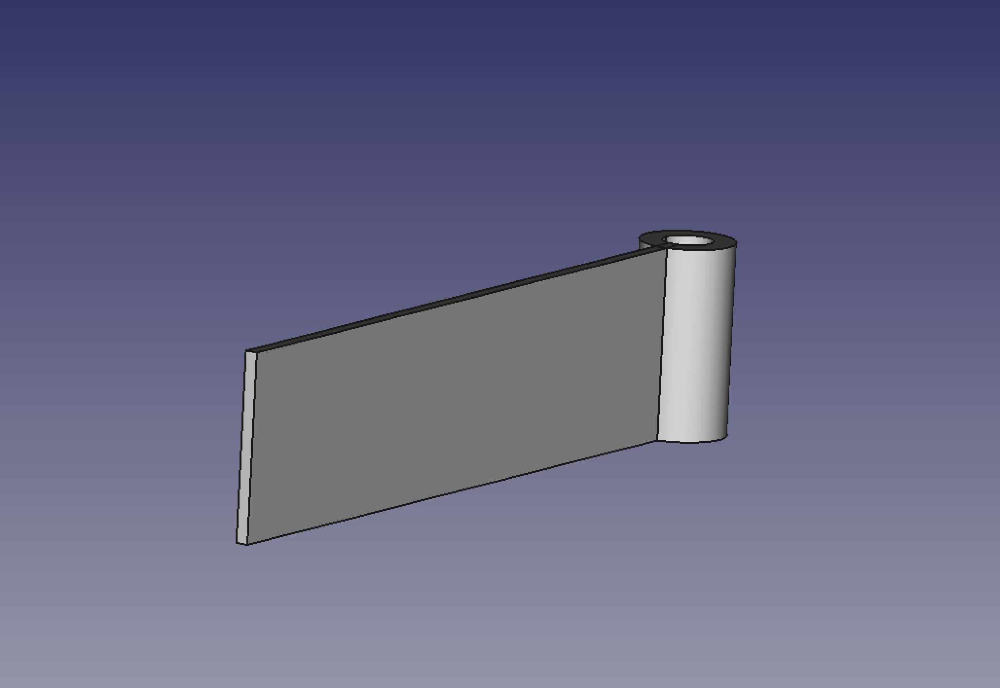
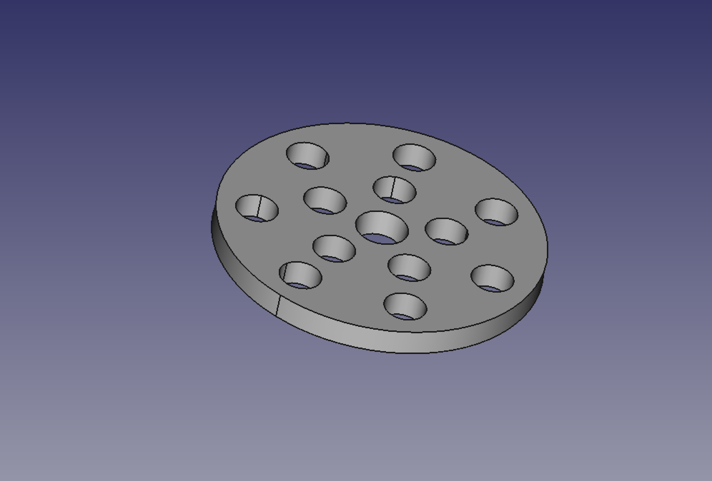

MissToHit - J Gyroscope
==============

OBJECT ONE

  
  

OBJECT TWO

  
  

## Description ##

## Freecad ##
For the design of these pieces we have used the Freecad software. Freecad is free software, it is built by the community. It has a strong use in community makers.

## Use ##
The use is simple. It's a cross-platform software you can download [here](https://www.freecadweb.org). If you open the file with the part code the Freecad viewer will render the piece. Once rendered you will be able to export this piece to the most convinient format, STL is the standard of most 3D printers.

We have created a "stl" directory with some stable versions of these pieces.
